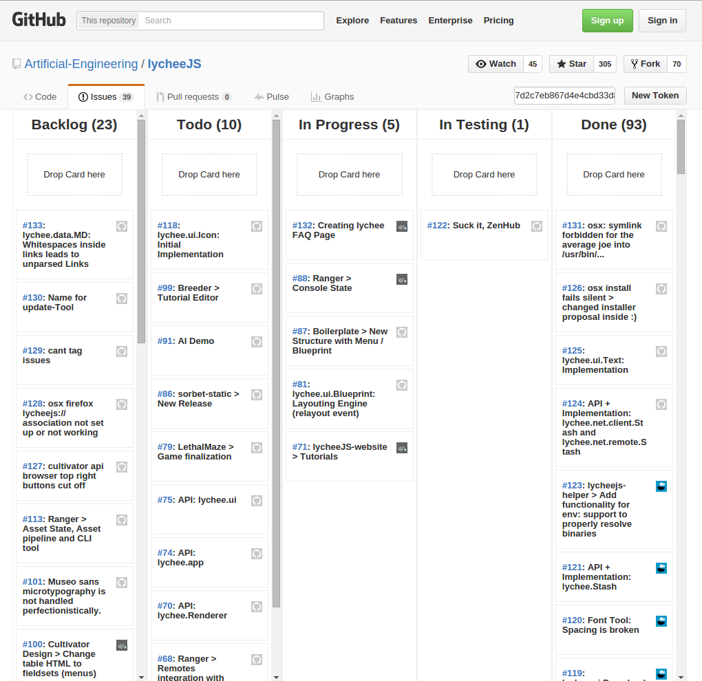
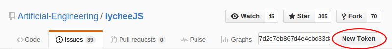
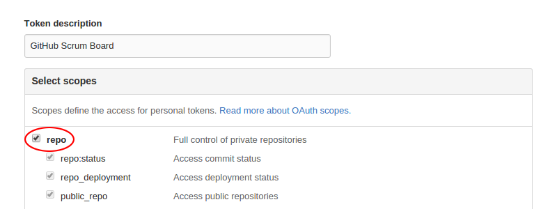
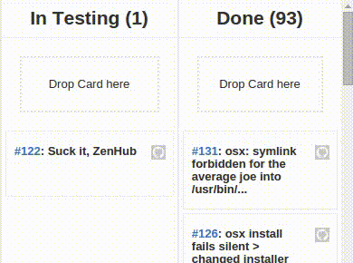

# GitHub Scrum Board
## The minimalistic GitHub-integrated Scrum Board

brought to you as libre software with joy and pride by [Artificial Engineering](http://artificial.engineering).

Support our libre Bot Cloud via BTC [1CamMuvrFU1QAMebPoDsL3JrioVDoxezY2](bitcoin:1CamMuvrFU1QAMebPoDsL3JrioVDoxezY2?amount=0.5&label=lycheeJS%20Support).

## Features

- Only overrides the Issues overview, everything else stays the same.
- Uses GitHub labels, so everything is properly integrated.
- Uses GitHub API, so everything stays on GitHub.
- Drag and Drop cards allows Trello / Jira and alike behaviour.
- No embedded or shitty iframes, everything is opened in new Browser Tabs.
- No third-party service is used, so everything stays on GitHub.
- Simple and minimalistic, blazing-fast.
- Libre Software, no nagging popups, no subscriptions or other crap.

## Overview

This Browser extension replaces the `./issues` URL of all repositories and shows
them as a Scrum Board. The Scrum Board is using Github's Issue labels (`todo`,
`in-progress` and `in-testing`) and everything is using the GitHub API only.

## Installation

If you want to install the extension locally, you can install it
in Developer Mode. We might push it to the Chrome Web Store in
future, but we haven't yet.

- Download the [master archive]() and unzip it somewhere.
- Open Chrome / Chromium / Opera and go to `chrome://extensions`.
- Set `[ ✓ ] Developer mode` to active.
- Click `Load unpacked extension` and select the `AE-github-master/chrome` folder.
- Visit your project's `Issues` overview page. Reload the page (e.g. use `[Ctrl] + [R]`).
- Follow the steps of the `Configuration` section.

## Configuration

The extension requires a so-called GitHub `Personal Access Token`
in order to work. This is required, because there's no server or
any API hosted by us - so authentication will only work via those
tokens.

Don't worry. The extension can only read your repository and
modify the issue labels. Nothing else is touched and you can't
break repositories you don't have access to.

You can easily generate one by clicking on the `New Token` button
that will appear on the `Issues` overview page.

On the `New Token Page`, you have to select only `repo` as the
access rights. The extension doesn't need more rights.

Now just copy/paste the token to the input text field on the `Issues`
overview page, unselect the input text field and Reload the page
via [Ctrl] + [R] or the Reload button.

## Usage

The usage is pretty simple. Just drag and drop an issue card onto
the wanted column.

## License

GitHub ScrumBoard is (c) 2016 Artificial-Engineering and released under MIT / Expat license.
For further details take a look at the [LICENSE.txt](LICENSE.txt) file.

## Contributing

Feel free to fork this project, Pull-Requests are always welcome!

## Work in Progress

Here's a short list what might don't work and needs some tweaks:

- The wrapper with the token input field shall be hidden and visible only if `\_get('token')` fails.

